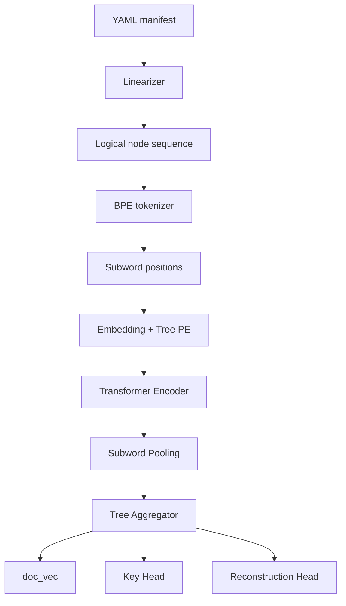
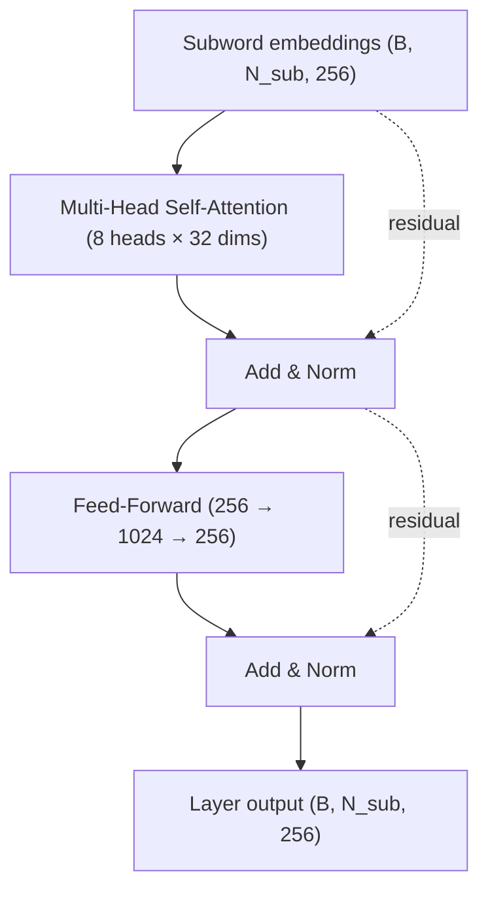

# YAML-BERT Architecture

A tree-aware BERT-style encoder for Kubernetes YAML manifests. It learns
structural patterns from 276K manifests using byte-level BPE subword
tokenization, tree positional encoding, and a bottom-up tree aggregator
that produces a document-level vector. Predictions are made by an atomic
Key Head conditioned on local hidden state, whole-document context,
and parent subtree context.

## What the Model Does

Given a Kubernetes YAML with a masked key, the model predicts what key
should go there:

```yaml
apiVersion: apps/v1
kind: Deployment
metadata:
  name: web
spec:
  [MASK]: 3          # Model predicts: "replicas" (99.1% confidence)
  selector:
    matchLabels:
      app: web
```

The model is trained on masked-key prediction (similar to BERT) over 276K
real Kubernetes YAMLs. It learns which keys belong where — parent-child
relationships, kind-specific patterns, sibling co-occurrence — from data
alone.

Beyond per-token prediction, the model also produces a document-level
vector (`doc_vec`, 256-dim) suitable for retrieval, clustering, and
structural probing.

## Pipeline Overview



## Model Architecture — Tensor Shapes Through the Pipeline

```
YAML manifest (text)
   │
   ▼
┌─────────────────────────────────────────────────────────────────────┐
│ Linearizer (DFS walk over YAML tree)                                │
│   → list[YamlNode] of length n_logical                              │
│     each carries: token, node_type, depth, sibling, parent_path     │
└─────────────────────────────────────────────────────────────────────┘
   │
   ▼  e.g. 14 logical nodes for a small Deployment
┌─────────────────────────────────────────────────────────────────────┐
│ BPE Tokenizer (byte-level, 8,192-token vocab)                       │
│   → each logical node's token expands to 1..K subword ids           │
│   → logical_id is recorded per subword                              │
│   → node_type/depth/sibling/parent_path replicated across subwords  │
└─────────────────────────────────────────────────────────────────────┘
   │
   ▼  e.g. ~22 subword positions
┌─────────────────────────────────────────────────────────────────────┐
│ Embedding + Tree Positional Encoding                                │
│                                                                     │
│   subword_embedding[token_ids]    →  (B, N_sub, 256)                │
│ + node_type_embedding[node_types] →  (B, N_sub, 256)                │
│ + depth_embedding[depths]         →  (B, N_sub, 256)                │
│ + sibling_embedding[siblings]     →  (B, N_sub, 256)                │
│ → LayerNorm                       →  (B, N_sub, 256)                │
└─────────────────────────────────────────────────────────────────────┘
   │
   ▼
┌─────────────────────────────────────────────────────────────────────┐
│ Transformer Encoder × 6 layers                                      │
│   self-attention (8 heads × 32 dims)                                │
│   feed-forward (256 → 1024 → 256)                                   │
│   each layer: input + residual through both sublayers               │
│   → (B, N_sub, 256)                                                 │
└─────────────────────────────────────────────────────────────────────┘
   │
   ▼  hidden states, still per subword
┌─────────────────────────────────────────────────────────────────────┐
│ Subword Pool: mean across subwords of each logical node             │
│   h_logical[b, l] = mean(h_sub[b, i] for i where logical_id[i]==l)  │
│   → (B, L_max, 256)                                                 │
└─────────────────────────────────────────────────────────────────────┘
   │
   ▼  per-logical-node hidden states
┌─────────────────────────────────────────────────────────────────────┐
│ Tree Aggregator (bottom-up, KEY-only)                               │
│   subtree_vec[v] = mean(h_logical[v], subtree_vec[child] for ...)   │
│   doc_vec = mean(subtree_vec[r] for r in top-level KEYs)            │
│   → subtree_vecs (B, L_max, 256)                                    │
│   → doc_vec (B, 256)                                                │
└─────────────────────────────────────────────────────────────────────┘
   │
   ├───────────────────────────────┐
   ▼                               ▼
┌────────────────────────────┐   ┌──────────────────────────────────┐
│ Key Head                   │   │ Reconstruction Head              │
│ input per logical KEY:     │   │ input per masked subtree root:   │
│   [h_logical ; doc_vec ;   │   │   [doc_vec ; pos_emb(root)]      │
│    s_parent]               │   │                                  │
│   (B, L_max, 3*256=768)    │   │   (M, 2*256=512)                 │
│ Linear → atomic_vocab_size │   │ MLP → atomic_vocab_size          │
│   (B, L_max, 11,080)       │   │   sigmoid for BCE                │
│                            │   │   (M, 11,080)                    │
│ Loss: cross-entropy on     │   │ Loss: BCE on bag-of-keys for     │
│   masked KEY positions     │   │   masked subtree                 │
│                            │   │                                  │
│ Used at inference for      │   │ (Empirically near-zero gradient  │
│   missing-field suggestion │   │  contribution — minimal training │
│                            │   │  signal in practice.)            │
└────────────────────────────┘   └──────────────────────────────────┘
```

`doc_vec` from the Tree Aggregator is also the model's document-level
embedding output — used directly for retrieval, clustering, and the
structural probes on the HF Space.

The steps below describe each component in detail.

## Step 1: Linearization — YAML Tree to Logical Node Sequence

The linearizer walks the YAML tree depth-first and produces a sequence
of `YamlNode` objects, one per key, value, list-key, or list-value. Tree
information is preserved in each node's metadata (depth, sibling index,
parent path, node type).

For the example YAML above, the linearizer produces:

| Pos | Token | Type | Depth | Sibling | Parent Path |
|-----|-------|------|-------|---------|-------------|
| 0 | `apiVersion` | KEY | 0 | 0 | `""` |
| 1 | `apps/v1` | VALUE | 0 | 0 | `"apiVersion"` |
| 2 | `kind` | KEY | 0 | 1 | `""` |
| 3 | `Deployment` | VALUE | 0 | 1 | `"kind"` |
| 4 | `metadata` | KEY | 0 | 2 | `""` |
| 5 | `name` | KEY | 1 | 0 | `"metadata"` |
| 6 | `web` | VALUE | 1 | 0 | `"metadata.name"` |
| 7 | `spec` | KEY | 0 | 3 | `""` |
| 8 | `replicas` | KEY | 1 | 0 | `"spec"` |
| 9 | `3` | VALUE | 1 | 0 | `"spec.replicas"` |
| 10 | `selector` | KEY | 1 | 1 | `"spec"` |
| 11 | `matchLabels` | KEY | 2 | 0 | `"spec.selector"` |
| 12 | `app` | KEY | 3 | 0 | `"spec.selector.matchLabels"` |
| 13 | `web` | VALUE | 3 | 0 | `"spec.selector.matchLabels.app"` |

Each node carries:
- **token**: the actual string
- **node_type**: `KEY`, `VALUE`, `LIST_KEY`, or `LIST_VALUE`
- **depth**: tree depth (0 = root level)
- **sibling_index**: position among siblings at the same level
- **parent_path**: dot-separated path from root to parent

List items get numeric indices in the path. `containers.0.name` means
the `name` key inside the first container.

These are **logical nodes** — one per YAML key/value — distinct from the
**subword positions** introduced in the next step.

## Step 2: BPE Subword Tokenization

Each logical node's token is encoded as a sequence of subword IDs using
a byte-level BPE tokenizer (8,192 entries, trained offline on the 276K
corpus).

```
apiVersion             → [apiVersion]                          1 subword
apps/v1                → [apps, /, v, 1]                       4 subwords
web-1                  → [web, -, 1]                           3 subwords
containerPort          → [containerPort]                       1 subword
app.kubernetes.io/name → [app, ., kubernetes, ., io, /, name]  7 subwords
```

Common K8s schema keys (apiVersion, kind, containerPort, nodeSelector,
restartPolicy, …) survived BPE merging as single tokens because they
appear so frequently. User-defined identifiers and long-tail values
decompose into multiple subwords.

After subword expansion, each subword position inherits the logical
node's `node_type`, `depth`, `sibling_index`, and `parent_path`. A new
`logical_id` field is added so the aggregator can later pool subwords
back into logical positions.

For example, the linearized node `(token="apps/v1", VALUE, depth=0)`
expands to 4 subword positions all sharing `node_type=VALUE`, `depth=0`,
and the same `logical_id`.

**Long values** (≥256 chars — file contents, CRD descriptions, etc.) are
replaced with a single `[LONG_VALUE]` token rather than encoded in full.
**Medium values** (64-255 chars) are truncated to 64 chars before BPE.
See [key-value-design-rationale.md](key-value-design-rationale.md) for
why values are treated this way.

## Step 3: Whole-Word MLM Masking

Following BERT, 15% of **logical KEY positions** are masked per document.
Values are never masked — they serve as context.

Whole-word masking: when a logical KEY is selected for masking, **all of
its subword positions** are replaced with `[MASK]`. The model cannot
peek at sibling subwords of the same key to guess the rest.

Token replacement at chosen positions (matching BERT):
- 80% → all subwords become `[MASK]`
- 10% → all subwords become random subwords
- 10% → unchanged (model must still predict it)

The label for each masked logical KEY is its **atomic key string** (e.g.,
`"replicas"`, `"containers"`) — looked up in the
`atomic_target_vocab` (11,080 entries; the Key Head's output space).
The label is per-logical-node, not per-subword.

## Step 4: Embedding — Subword + Tree Positional Encoding

Each subword position becomes a 256-dim vector by summing four
embeddings, followed by LayerNorm:

```
embedding[i] = LayerNorm(
    subword_embedding[subword_id[i]]    # 8,192 × 256
  + node_type_embedding[node_type[i]]   # 4 × 256
  + depth_embedding[depth[i]]           # 16 × 256
  + sibling_embedding[sibling[i]]       # 32 × 256
)
```

| Table | Size | What it encodes |
|-------|------|-----------------|
| `subword_embedding` | 8,192 × 256 | Token identity (one unified table for keys AND values) |
| `node_type_embedding` | 4 × 256 | KEY / VALUE / LIST_KEY / LIST_VALUE |
| `depth_embedding` | 16 × 256 | Tree depth (0-15, clamped) |
| `sibling_embedding` | 32 × 256 | Position among siblings (0-31, clamped) |

KEYs and VALUEs share the same `subword_embedding` table — what
distinguishes them at the input level is the `node_type_embedding`
that's added. This is a deliberate v9 choice: subwords like `kube`,
`controller`, `service` appear in both keys and values; one shared table
exploits that overlap.

Kind, parent, and apiVersion awareness are NOT in the input — the model
must build them by attending across positions through the encoder.

## Step 5: Transformer Encoder

A standard transformer encoder: 6 layers, 8 attention heads, d_ff=1024,
operating on the subword-position sequence.



Each subword position attends to every other (within `max_seq_len=768`).
Tree positional information embedded in the input lets the model
distinguish structural relationships through attention.

## Step 6: Subword Pooling + Tree Aggregator

After the encoder, the model has per-subword hidden states `(B, N_sub,
256)`. Two transformations follow.

### 6a. Subword pooling

Mean-pool subwords of each logical node back into per-logical-node
vectors:

```
h_logical[doc, l] = mean(h_subword[doc, i] for i where logical_id[i] == l)
```

After pooling, the shape is `(B, L_max, 256)` — one hidden vector per
logical KEY/VALUE, not per subword.

### 6b. Bottom-up tree aggregator (KEY-only)

The aggregator combines KEY logical positions into `subtree_vec`s and
ultimately a single `doc_vec`. Bottom-up, depth-first:

```
For each KEY logical position v (deepest depth first):
    subtree_vec[v] = mean(h_logical[v], subtree_vec[c] for c in children(v))

doc_vec = mean(subtree_vec[r] for r in top-level KEYs)
```

**VALUE positions are not aggregated.** They influence `doc_vec`
indirectly through attention (their content reaches neighboring KEY
hidden states via self-attention, which then flow into `doc_vec` via the
aggregator). The aggregator stays KEY-only by design — see
[key-value-design-rationale.md](key-value-design-rationale.md).

The aggregator has two execution paths (numerically equivalent):
- **Vectorized**: batched scatter operations, processed depth-by-depth.
  Default during training.
- **Reference**: per-document Python loop. Kept for tests.

Equivalence is locked by `tests/test_aggregator_vectorized.py`.

## Step 7: Prediction Heads

Two heads consume the aggregator outputs.

### Key Head (atomic key prediction)

Input: concatenation of `[h_logical ; doc_vec ; s_parent]` at each
logical KEY position, where:
- `h_logical[v]` is the pooled hidden state at position `v`
- `doc_vec` is the document-level vector (broadcast)
- `s_parent[v]` is the parent's `subtree_vec` (or `doc_vec` if `v` is
  top-level)

This 3·256 = 768-dim input is projected by a linear layer to
`atomic_target_vocab_size` (11,080) logits.

The output prediction is "what atomic key string should be here?" Same
target vocabulary across all positions — a closed set of whole key
strings (e.g., `containers`, `replicas`, `restartPolicy`).

At masked positions, cross-entropy loss is computed against the masked
key's atomic ID. Unmasked positions get label `-100` (ignored).

### Reconstruction Head

Input: `[doc_vec ; pos_emb(root_depth, root_sibling)]` per masked
subtree root.

Output: bag-of-keys multi-hot prediction over `atomic_target_vocab`.
Trained with BCE loss against the actual set of atomic keys present in
the masked subtree.

**Empirically, the reconstruction loss stays near 0.0003 throughout
training** — the bag-of-keys task is too easy (sparse positives,
~30/11,080 per subtree). It contributes <0.15% of training gradient. See
[future-directions.md](future-directions.md) for proposed replacements
(path-bigram bag, parent-key prediction, or removal).

## Vocabularies

The model has **two distinct vocabularies** that serve different jobs.

| Vocabulary | Size | Job | Where it lives |
|---|---|---|---|
| **Subword vocab** | 8,192 | INPUT encoding (text → token IDs via BPE) | `tokenizers/v9_unified_bpe_8k.json` |
| **Atomic target vocab** | 11,080 | OUTPUT prediction (Key Head outputs over these) | inside `output_*/vocab.json` |

The subword vocab is a byte-level BPE tokenizer trained offline. Tokens
are subword fragments: `web`, `-`, `1`, `nginx`, `:`, `kube`. Used to
encode any input string deterministically.

The atomic target vocab is a curated set of whole atomic KEY strings
above a frequency threshold (`min_freq=5`). Tokens are full key strings:
`containers`, `restartPolicy`, `apiVersion`, `app.kubernetes.io/name`.
The Key Head's softmax is over this vocab.

**Why two vocabs?** The input must handle any string (BPE-decomposable).
The output target should be a meaningful whole-key prediction (predict
`containers`, not subword-by-subword `con | tainers`). The two
vocabularies overlap conceptually but serve opposite directions.

## Model Configuration

```python
d_model = 256              # Hidden dimension
num_layers = 6             # Transformer encoder layers
num_heads = 8              # Attention heads (32 dims per head)
d_ff = 1024                # Feed-forward hidden dimension (4 × d_model)
max_depth = 16             # Maximum tree depth tracked
max_sibling = 32           # Maximum sibling index tracked
max_seq_len = 768          # Subword sequence cap
mask_prob = 0.15           # Fraction of logical KEYs masked per document
recon_enabled = True       # Reconstruction objective on/off
recon_loss_weight = 0.5    # Weight for recon loss in total
lr = 1e-4                  # Learning rate (AdamW)
batch_size = 32            # Training batch size
num_epochs = 20            # Training epochs
```

Total parameters: **18.4M** (subword_embedding ≈ 2.1M; encoder + heads ≈
16.3M).

## Worked Example: End-to-End

Trace a single masked-prediction through the pipeline.

### Input

```yaml
apiVersion: apps/v1
kind: Deployment
metadata:
  name: web
spec:
  replicas: 3
  selector:
    matchLabels:
      app: web
```

### After linearization

14 logical nodes (as in the table in Step 1).

### After BPE expansion

Approximate subword positions (actual depends on the trained BPE):

| Sub-pos | logical_id | subword | node_type | depth |
|---|---|---|---|---|
| 0 | 0 | `apiVersion` | KEY | 0 |
| 1 | 1 | `apps` | VALUE | 0 |
| 2 | 1 | `/` | VALUE | 0 |
| 3 | 1 | `v` | VALUE | 0 |
| 4 | 1 | `1` | VALUE | 0 |
| 5 | 2 | `kind` | KEY | 0 |
| 6 | 3 | `Deployment` | VALUE | 0 |
| 7 | 4 | `metadata` | KEY | 0 |
| 8 | 5 | `name` | KEY | 1 |
| ... | ... | ... | ... | ... |

14 logical → ~22 subword positions.

### Masking decision

Random selection (15% of KEY logicals) picks logical position 8
(`replicas`). All subwords with `logical_id == 8` get replaced with
`[MASK]`. The label `"replicas"` is recorded at logical position 8;
all other logicals get label `-100`.

### Encoding

Each subword position is embedded (subword + node_type + depth +
sibling), then the encoder transforms `(1, 22, 256)` through 6 layers
of self-attention + FFN.

### Pooling + aggregation

- **Subword pooling**: each logical's subwords are mean-pooled →
  `h_logical` shape `(1, 14, 256)`.
- **Aggregator**: bottom-up KEY aggregation produces `subtree_vec` per
  KEY position and a single `doc_vec` `(1, 256)`.

### Key Head prediction

At logical position 8 (the masked `replicas`):

```
input = [h_logical[0, 8] ; doc_vec[0] ; s_parent[0, 8]]    # 768-dim
logits = token_head(input)                                   # 11,080-dim
prob = softmax(logits)
```

`s_parent[0, 8]` is the subtree_vec of `spec` (the parent KEY at logical
position 7). It encodes "I'm inside a spec subtree of a Deployment."

The model is expected to put high probability on `"replicas"` (atomic
target id corresponding to that string).

### Loss

Cross-entropy at logical position 8 against the label `"replicas"`.
Contributes to MLM loss. Plus the recon loss (very small) over any
sampled masked subtrees.

## Evaluation Results

Headline numbers (full evaluation in
[v9-subword-results.md](v9-subword-results.md)):

| Metric | Value |
|---|---|
| Pre-training capability tests | 92/93 (27/28 capabilities) |
| Fine-tuning capability tests | 24/28 |
| Structural tests | 8/9 |
| Bigger-boat tests | 13/13 |
| kind k-NN purity @ 5 | 98.9% |
| apiVersion classification | 99.8% |
| Service type classification | 99.7% |
| Total params | 18.4M |

5 HF-Space structural probes (cosine clustering tests):
- ✅ Service type (same-type pairs cluster tighter)
- ✅ Pods in same namespace vs different namespace
- ✅ apiVersion sensitivity (same kind ≠ apiVersion clusters tightest)
- ✅ Pod vs Deployment wrapping
- ❌ Pod ± initContainers (content sensitivity dominates init structure
  for these specific pods — discussed in the probe verdict text)

3 probes designed to fail (define future targets):
- ✅ (weakly) version ordering — monotonic but deltas are tiny
- ❌ foreign-key consistency (volumeMounts ↔ volumes)
- ❌ content retrieval (image-based k-NN)

## File Structure

```
yaml_bert/
├── types.py                 # NodeType, YamlNode
├── linearizer.py            # YAML string → list[YamlNode]
├── annotator.py             # Domain annotations
├── tokenizer.py             # SubwordTokenizer (wraps HF tokenizers)
├── vocab.py                 # Vocabulary, VocabBuilder, atomic_target_vocab
├── config.py                # YamlBertConfig
├── embedding.py             # YamlBertEmbedding (subword + tree PE)
├── dataset.py               # BPE expansion + whole-word MLM masking
├── subtree_masking.py       # Recon-objective subtree selection
├── aggregator.py            # Subword pooling + bottom-up tree aggregation
├── reconstruction_head.py   # Recon Head (BCE over bag-of-keys)
├── model.py                 # YamlBertModel: encoder + aggregator + heads
├── suggest.py               # Missing-field suggestion
├── cache.py                 # Linearized corpus cache
├── visualize.py             # Attention visualization helpers
└── (dormant building blocks: tree_bias, pooling, attention_pooling)

scripts/
├── train.py                       # Training entry point
├── train_unified_tokenizer.py     # Offline BPE training
├── audit_v9_batch.py              # Single-batch shape audit
├── eval_probes.py                 # sklearn probes on doc_vec dumps
├── v9_structural_probes.py        # 5 HF-Space-style probes
├── v10_failing_probes.py          # 3 probes that fail (future targets)
├── build_galaxy.py                # UMAP projection for HF Space galaxy
├── deploy_hf_space.sh             # Bundle + upload Space
└── validate_subword_pipeline.py   # Sanity-check the BPE pipeline

model_tests/
├── test_capabilities.py     # 121+ tests across 30 capabilities
├── test_structural.py       # 9 structural reasoning tests
└── test_bigger_boat.py      # 13 cross-kind generalization tests

hf-space/                    # Gradio app deployed to vimalk78/yaml-bert
tests/                       # pytest unit tests
testdata/                    # Sample K8s YAMLs
docs/                        # Documentation + design specs + plans
tokenizers/                  # Trained BPE artifacts
```

## Related Reading

- [Key/Value Design Rationale](key-value-design-rationale.md) — why KEYs are first-class as aggregation targets and VALUEs are second-class
- [Results](v9-subword-results.md) — training + evaluation in detail
- [Future Directions](future-directions.md) — what's open for the next iteration
- [Tree Positional Encoding Explained](tree-positional-encoding-explained.md) — mathematical foundations of the tree-aware input encoding
- [Inference Pipeline](inference-pipeline.md) — how `suggest_missing_fields()` works
- [Design specs](superpowers/specs/) — versioned spec docs that drove each architectural change
