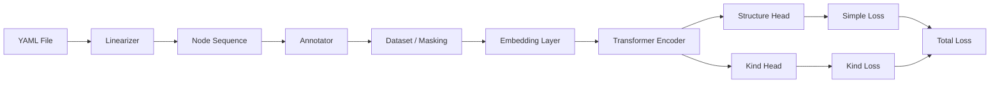
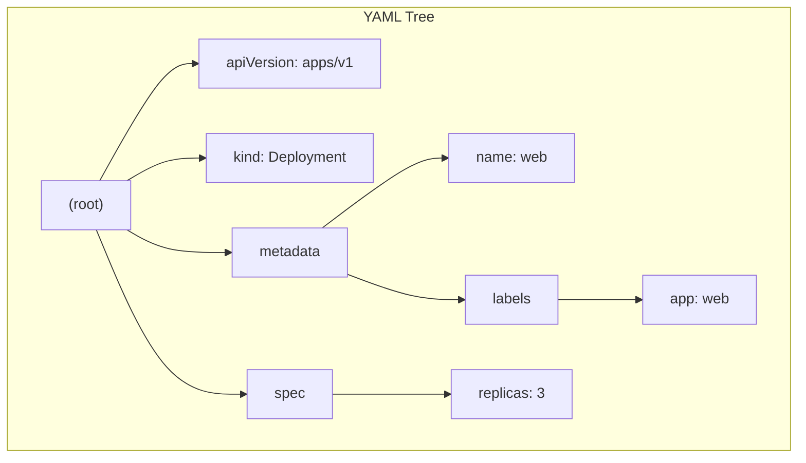
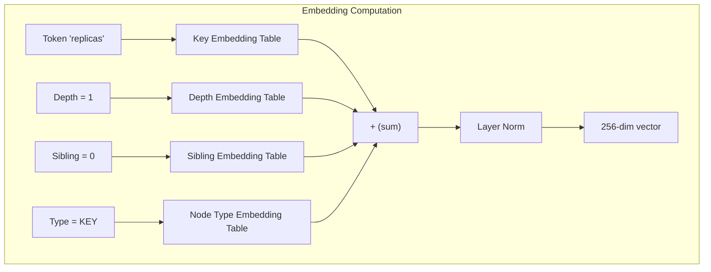
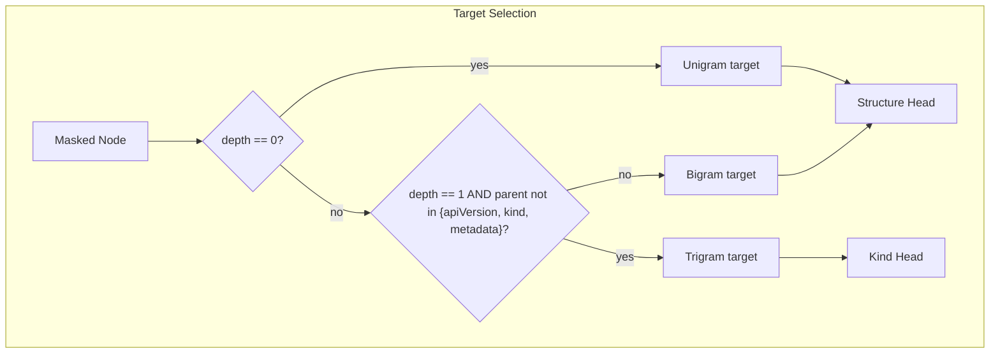
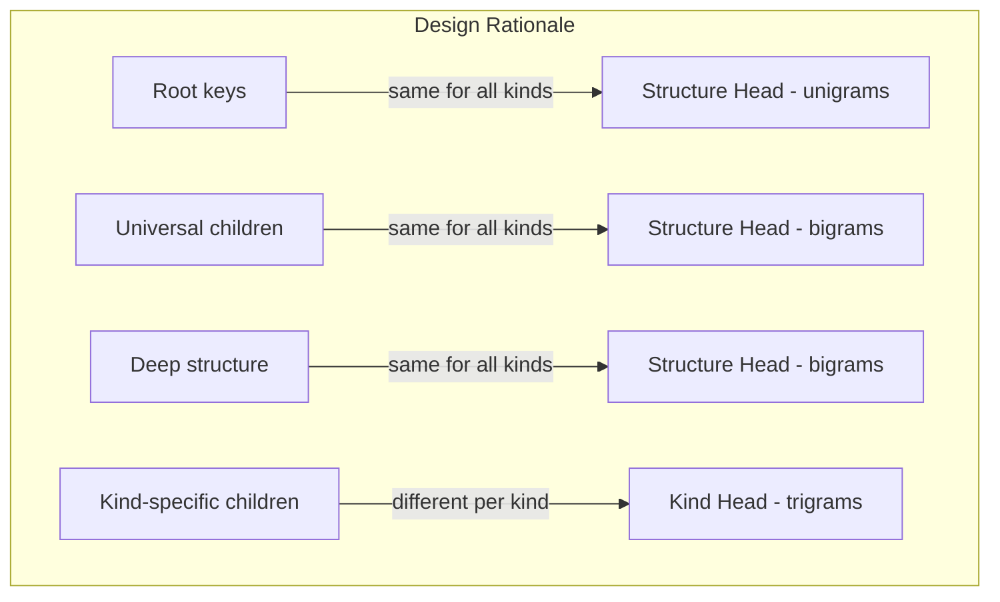
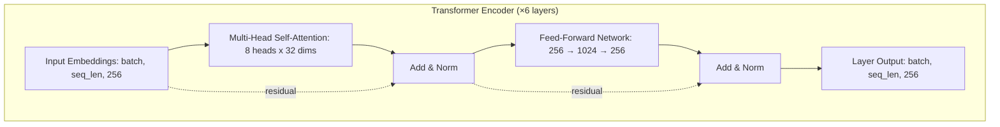
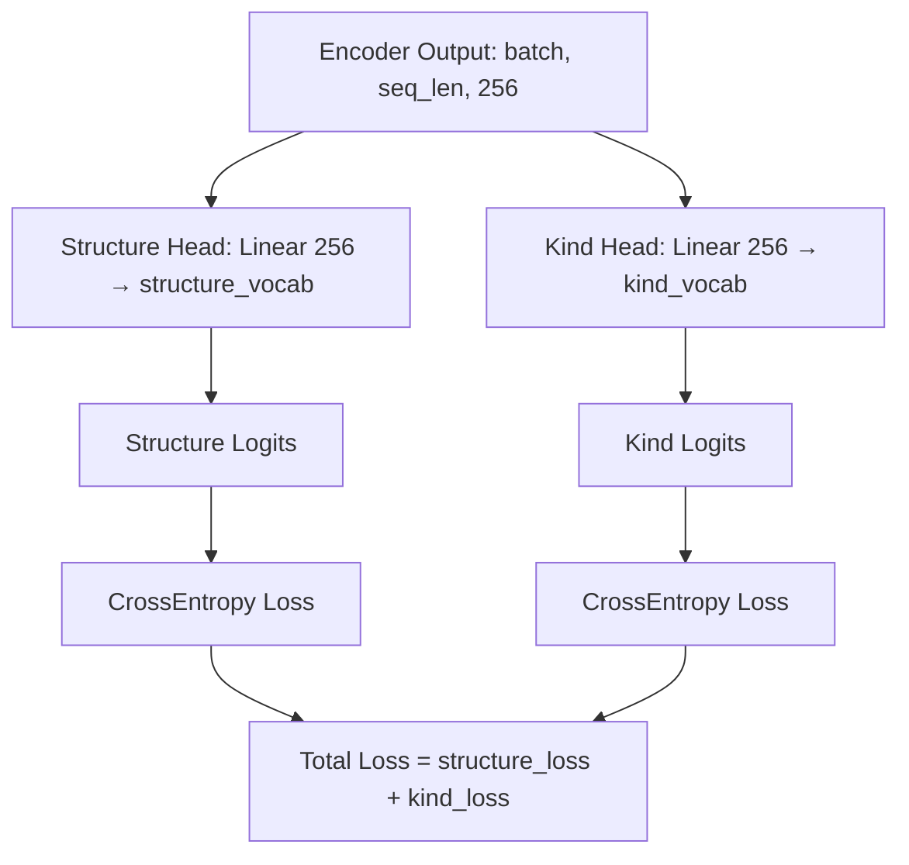

# YAML-BERT Architecture

A transformer model that learns structural patterns from Kubernetes YAML manifests. It uses tree positional encoding to understand YAML's hierarchical structure and compound prediction targets to learn both universal and kind-specific patterns.

## What the Model Does

Given a Kubernetes YAML with a masked (hidden) key, the model predicts what key should go there:

```yaml
apiVersion: apps/v1
kind: Deployment
metadata:
  name: web
spec:
  [MASK]: 3          # Model predicts: "replicas" (99.1% confidence)
  selector:
    matchLabels:
      app: web
```

This is trained on 276,000 real Kubernetes YAMLs using masked key prediction (similar to how BERT learns language). The model learns which keys belong where — parent-child relationships, kind-specific patterns, sibling co-occurrence — purely from the data.

## Pipeline Overview



## Step 1: Linearization — YAML Tree to Sequence

YAML is a tree structure. Transformers process sequences. The linearizer converts the tree into a flat sequence of nodes using depth-first traversal, preserving the tree information in each node's metadata.



The linearizer walks this tree depth-first and produces a sequence of `YamlNode` objects:

| Position | Token | Type | Depth | Sibling | Parent Path |
|----------|-------|------|-------|---------|-------------|
| 0 | `apiVersion` | KEY | 0 | 0 | `""` |
| 1 | `apps/v1` | VALUE | 0 | 0 | `"apiVersion"` |
| 2 | `kind` | KEY | 0 | 1 | `""` |
| 3 | `Deployment` | VALUE | 0 | 1 | `"kind"` |
| 4 | `metadata` | KEY | 0 | 2 | `""` |
| 5 | `name` | KEY | 1 | 0 | `"metadata"` |
| 6 | `web` | VALUE | 1 | 0 | `"metadata​.name"` |
| 7 | `labels` | KEY | 1 | 1 | `"metadata"` |
| 8 | `app` | KEY | 2 | 0 | `"metadata.labels"` |
| 9 | `web` | VALUE | 2 | 0 | `"metadata.labels.app"` |
| 10 | `spec` | KEY | 0 | 3 | `""` |
| 11 | `replicas` | KEY | 1 | 0 | `"spec"` |
| 12 | `3` | VALUE | 1 | 0 | `"spec.replicas"` |

Each node carries:
- **token**: the actual string (`"replicas"`, `"3"`, `"Deployment"`)
- **node_type**: one of `KEY`, `VALUE`, `LIST_KEY`, `LIST_VALUE`
- **depth**: tree depth (0 = root level)
- **sibling_index**: position among siblings at the same level
- **parent_path**: dot-separated path from root to parent (`"spec"`, `"metadata.labels"`)

List items get numeric indices in the path. For example, `containers.0.name` means the `name` key inside the first container.

## Step 2: Tree Positional Encoding

Standard transformers use sequential position (position 0, 1, 2...). This doesn't capture tree structure — "replicas" at position 11 tells you nothing about it being under "spec".

YAML-BERT replaces sequential position with **tree positional encoding**: three learned embedding tables that encode where a node sits in the tree.



### Embedding Tables

| Table | Size | What It Encodes |
|-------|------|-----------------|
| Key Embedding | key_vocab_size × 256 | Token identity for keys |
| Value Embedding | value_vocab_size × 256 | Token identity for values |
| Depth Embedding | 16 × 256 | Tree depth (0 to 15) |
| Sibling Embedding | 32 × 256 | Position among siblings (0 to 31) |
| Node Type Embedding | 4 × 256 | KEY, VALUE, LIST_KEY, or LIST_VALUE |

Keys and values use **separate embedding tables** to prevent values from polluting the key embedding space. If shared, arbitrary values like `nginx`, `true`, `80` would vastly outnumber structural keys and dominate the space. Separate tables let key embeddings develop purely structural relationships without interference from values.

### Token Routing

The embedding layer routes each token to the correct table based on its node type:

```
if node_type is KEY or LIST_KEY:
    token_embedding = key_embedding_table[token_id]
else:
    token_embedding = value_embedding_table[token_id]
```

The final embedding for each position is:

```
embedding = LayerNorm(token_embedding + depth_embedding + sibling_embedding + node_type_embedding)
```

## Core Design Principle

The model does NOT receive the document kind (`Deployment`, `Service`) or the parent key (`spec`, `metadata`) as input embeddings. It must **discover** them by attending to surrounding tokens through the transformer layers.

To predict the trigram `Deployment::spec::replicas` at a masked position, the model must attend to the `Deployment` value token elsewhere in the sequence, figure out what kind of document it's in, and use that understanding to predict the correct kind-specific key. Similarly, to predict the bigram `containers::image`, the model must attend to the `containers` key above it and understand "I'm inside a container list item" — without the parent in the target, a bare `image` prediction would carry no structural meaning since `image` can appear in many different contexts. This is why values are never masked — they must remain visible as context for the model to attend to. The compound prediction targets force the model to build kind-awareness and parent-awareness through computation.

Probing experiments confirm this: kind information starts at 21% at the embedding layer (near random) and rises to 51% at the final layer, built entirely through attention. Parent information follows the same pattern: 36% → 52%.

## Step 3: Masking Strategy

Following BERT, we mask 15% of **key nodes** (never values — values serve as context clues) and train the model to predict the original key.

```
Original:  apiVersion  apps/v1  kind  Deployment  metadata  name    web   spec  replicas  3
Masked:    apiVersion  apps/v1  kind  Deployment  metadata  [MASK]  web   spec  replicas  3
Target:                                                     ↑ "name"
```

Token replacement (same as BERT):
- 80% of masked positions → `[MASK]` token
- 10% → random key from vocabulary
- 10% → unchanged (model must still predict it)

Only KEY and LIST_KEY tokens are eligible for masking. VALUE and LIST_VALUE tokens are never masked — they serve as context that helps the model make predictions.

Masking only 15% per document may seem insufficient to learn a full document's structure. But each document is seen **many times** across 15 epochs, with a different random 15% masked each time. Over 15 epochs, every key position gets masked roughly 2 times on average. Across 276K documents, the model sees millions of masked predictions total — and the learning accumulates in the shared weights. What the model learns from predicting `replicas` in one Deployment helps it predict `replicas` in every other Deployment.

## Step 4: Compound Prediction Targets

This is the core innovation. Instead of predicting just the key name, the model predicts **compound targets** that encode structural context.

### The Problem with Simple Targets

If the target is just `"name"`, the model produces the same prediction whether `name` appears under `metadata`, under `containers`, or under `ports`. There's no incentive to learn context-dependent representations.

### Two Types of Targets



**Universal root keys**: `apiVersion`, `kind`, `metadata` — these are the same across all Kubernetes resource types.

The trigram target is simply the bigram target with the document kind prepended: `parent::key` becomes `kind::parent::key`. Because this creates a different vocabulary (kind-prefixed targets don't overlap with plain bigrams), it goes to a separate prediction head — the Kind Head. This forces the model to learn what keys are expected under each kind.

#### Structure Head (Bigrams)

Handles universal and deep structure. The target encodes the parent-child relationship:

| Node | Depth | Parent | Target | Why |
|------|-------|--------|--------|-----|
| `kind` | 0 | (root) | `"kind"` | Root keys are unigrams — same everywhere |
| `name` | 1 | metadata | `"metadata::name"` | Under a universal parent — same for all kinds |
| `labels` | 1 | metadata | `"metadata::labels"` | Same |
| `image` | 2+ | containers | `"containers::image"` | Deep structure uses bigrams |
| `limits` | 3+ | resources | `"resources::limits"` | Same |

The `::` separator is used (not `.`) because Kubernetes keys can contain dots (e.g., `app.kubernetes.io/name`).

#### Kind Head (Trigrams)

Handles kind-specific structure. Only activates at depth 1 under non-universal root keys:

| Node | Kind | Parent | Target |
|------|------|--------|--------|
| `replicas` | Deployment | spec | `"Deployment::spec::replicas"` |
| `type` | Service | spec | `"Service::spec::type"` |
| `schedule` | CronJob | spec | `"CronJob::spec::schedule"` |
| `data` | ConfigMap | data | `"ConfigMap::data::key1"` |

Because the Kind Head must predict `Deployment::spec::replicas` for a Deployment but `Service::spec::type` for a Service — both at the same structural position (`spec.[MASK]`) — the model is forced to produce **different hidden states** depending on the document kind. The model must figure out the kind from context (attending to the unmasked `kind: Deployment` value) to predict the correct trigram target.

### Why This Split?



- **Root keys** are universal — making them kind-specific would fragment the training signal across kinds, forcing the model to learn `Deployment::apiVersion` and `Service::apiVersion` separately when they're structurally identical
- **Depth 1 under non-universal parents** is where kinds differ — `spec` means different things for Deployment vs Service
- **Deep structure** (depth 2+) is mostly kind-independent — `containers.image` is the same whether in a Pod, Deployment, or Job
- **Universal parents** (metadata, apiVersion, kind) have the same children regardless of kind

## Step 5: Transformer Encoder

Standard transformer encoder, 6 layers, 8 attention heads:



Each token can attend to every other token in the sequence. The tree positional encoding (depth, sibling, type) embedded in the input allows the model to distinguish structural relationships through attention — a token at depth 2 under `containers` attends differently than a token at depth 1 under `metadata`.

### What Happens Through the Layers

Probing experiments show how information evolves through the layers:

| Layer | Depth | Type | Parent | Kind |
|-------|-------|------|--------|------|
| Embedding | 96.7% | 95.9% | 35.6% | 21.5% |
| Layer 0 | 90.2% | 96.4% | 54.3% | 19.6% |
| Layer 1 | 84.4% | 91.6% | 46.2% | 26.1% |
| Layer 2 | 78.9% | 88.0% | 55.3% | 30.4% |
| Layer 3 | 81.3% | 85.2% | 44.5% | 31.3% |
| Layer 4 | 73.2% | 84.2% | 41.6% | 33.3% |
| Layer 5 | 75.4% | 84.0% | 51.7% | 50.7% |

- **Depth and type** (in the input): start high, gradually degrade as the model repurposes dimensions
- **Parent and kind** (NOT in the input): start low, increase through layers — genuinely learned through attention

## Step 6: Two Prediction Heads

The transformer output feeds into two independent linear layers:



At each masked position, only one head's label is active (the other is -100, ignored by loss). Which head is active depends on the `compute_target` function — determined by the node's depth and parent.

### Vocabulary

All vocabularies are built **before training starts** by scanning all 276K training documents. They are static lookup tables saved to `vocab.json` — they are not learned or modified during training.

There are two groups of vocabularies that serve different purposes:

**Input vocabularies** — used to convert tokens into integer IDs for the embedding layer:

| Vocabulary | Purpose | Example Entries |
|------------|---------|-----------------|
| Key vocab | Look up key tokens for key_embedding table | `name`, `image`, `replicas` |
| Value vocab | Look up value tokens for value_embedding table | `v1`, `nginx`, `ClusterIP` |
| Special tokens | Reserved tokens shared across vocabs | `[PAD]`=0, `[UNK]`=1, `[MASK]`=2 |

**Target vocabularies** — used only for label construction (during data preparation) and prediction decoding (during inference). These map compound target strings to integer IDs. The model's prediction heads output a score for each entry in these vocabs:

| Vocabulary | Purpose | Example Entries |
|------------|---------|-----------------|
| Structure targets | Labels for the Structure Head (bigrams) | `metadata::name`, `containers::image` |
| Kind targets | Labels for the Kind Head (trigrams) | `Deployment::spec::replicas`, `Service::spec::type` |

The input and target vocabularies are **completely separate** — they don't share weights or IDs. The key vocab maps `name` → some ID for the embedding table. The structure target vocab maps `metadata::name` → a different ID for the loss function. The model learns to bridge this gap: produce a hidden state that the prediction head maps to the correct target ID.

**Building the vocabularies:**

1. Scan all training documents, count every key token and value token
2. For each KEY node, compute its compound target string using the target selection rules
3. Count how many times each compound target appears
4. Discard tokens and targets that appear fewer than `min_freq` times (default: 100)
5. Sort remaining entries and assign integer IDs

**Vocabulary sizes** (with `min_freq=100` on 276K documents):

| Vocabulary | Size |
|------------|------|
| Key tokens | ~700 |
| Value tokens | ~700 |
| Kind tokens | ~50 |
| Structure targets | ~1,600 |
| Kind targets | ~700 |

### Relation to Other Approaches

Having different input and output vocabularies is unusual for BERT-style pre-training — standard BERT uses the same word vocabulary for both input and output (mask a word, predict that word from the same vocabulary). However, different input/output vocabularies are common in other NLP tasks built on top of BERT:

- **Named Entity Recognition** — input vocabulary is words, output vocabulary is entity labels (`PER`, `ORG`, `LOC`)
- **Relation Extraction** — input is tokens, output is relation types (`works_at`, `born_in`)
- **Semantic Parsing** — input is natural language tokens, output is structured query tokens (SQL keywords, table names)
- **Translation** (encoder-decoder models) — input vocabulary is one language, output vocabulary is another

In all these cases, the model learns to bridge two different vocabularies through a shared hidden representation. YAML-BERT does this during pre-training itself: the input sees individual tokens (`name`, `replicas`), while the output predicts compound structural targets (`metadata::name`, `Deployment::spec::replicas`). The transformer's hidden states learn to encode enough context to map from one vocabulary space to the other.

## Model Configuration

```python
d_model = 256          # Hidden dimension
num_layers = 6         # Transformer encoder layers
num_heads = 8          # Attention heads (32 dims per head)
d_ff = 1024            # Feed-forward hidden dimension (4 × d_model)
max_depth = 16         # Maximum tree depth tracked
max_sibling = 32       # Maximum sibling index tracked
mask_prob = 0.15       # Fraction of keys masked per document
lr = 1e-4              # Learning rate (AdamW)
batch_size = 24        # Training batch size
```

Total parameters: ~7M (most in embedding tables and prediction heads).

## Training

- **Dataset**: 276,000 Kubernetes YAMLs from [substratusai/the-stack-yaml-k8s](https://huggingface.co/datasets/substratusai/the-stack-yaml-k8s) on HuggingFace
- **Hardware**: NVIDIA GTX 1650 (4GB VRAM)
- **Duration**: 15 epochs, ~15 hours
- **Optimizer**: AdamW (lr=1e-4, weight_decay=0.01)
- **Gradient clipping**: max_norm=1.0
- **Loss**: sum of structure_loss + kind_loss
- **NaN handling**: batches with NaN loss are skipped

### Loss Curve

```
Epoch  1: 2.1167 (kind: 0.5226, simple: 1.5941)
Epoch  5: 0.7650 (kind: 0.1136, simple: 0.6513)
Epoch 10: 0.6400 (kind: 0.0893, simple: 0.5507)
Epoch 15: 0.5866 (kind: 0.0789, simple: 0.5077)
```

### Checkpoint Resumption

Training supports automatic resume from the latest checkpoint via a systemd service (`scripts/train_service.sh`). On power loss or restart, training continues from the last saved epoch with optimizer state intact.

## Evaluation Results

**Capability tests** (93/93 passing) — 30 capabilities covering parent-child validity, kind conditioning, depth sensitivity, sibling awareness, cross-kind discrimination, RBAC structure, volume semantics, probe structure, and more. Each capability has multiple test cases with handcrafted YAMLs. The model passes all 93 pre-training tests and 27/28 fine-tuning tests.

**Structural tests** (7/9 passing) — tests for kind conditioning, wrong parent detection, depth awareness, spec vs status distinction, nonsense YAML confidence drop, and missing required fields. The 2 failures are vocabulary coverage issues (rare targets filtered by min_freq).

**Document similarity** (0.42 average off-diagonal) — cosine similarity between mean-pooled document embeddings for Deployment, Service, Pod, and ConfigMap. The model produces clearly different representations for different kinds. Deployment-Pod similarity is highest (0.60) because Pods are structurally embedded inside Deployments.

**CRD generalization** (11/11 passing) — unseen kinds not in training data (e.g., `RocketLauncher`, `WorkloadRunner`) still get correct predictions for universal structure. Root keys, metadata children, and container patterns all transfer. The structure head generalizes because bigram targets are kind-independent.

**Path reconstruction** (33/38 edges correct) — mask every key in a YAML one at a time and verify the model predicts the correct compound target (the correct tree edge). 87% of edges are correct. Failures are structurally symmetric siblings (limits vs requests, selector vs labels) where the context is ambiguous.

**Layer probing** — linear probes at each transformer layer measuring depth, type, parent, and kind accuracy. Depth and type (in the input) start high and degrade through layers. Parent and kind (not in the input) start low and increase — confirming the model genuinely learns these from the prediction targets through attention.

**Missing field suggestions** — tested across 17 resource kinds with curated YAMLs and on 6,686 real resources from a live OpenShift cluster. Low false positive rate on production YAMLs. Catches missing `resources.requests`, `metadata.labels`, `spec.strategy`, `configMap.items` among others.

**Real cluster validation** — 277 pods, 96 services, 523 configmaps from a live cluster. Correctly produces zero suggestions on fully-configured resources. Identifies genuinely missing fields like `capabilities` in security contexts and `limits` in resource specs.

## File Structure

```
yaml_bert/
├── types.py          # NodeType enum, YamlNode dataclass
├── config.py         # YamlBertConfig dataclass
├── linearizer.py     # YAML string → list[YamlNode]
├── annotator.py      # Domain-specific annotations (list ordering)
├── vocab.py          # Vocabulary, VocabBuilder, compute_target()
├── embedding.py      # YamlBertEmbedding (tree positional encoding)
├── model.py          # YamlBertModel (encoder + two prediction heads)
├── dataset.py        # YamlDataset, masking, collation
├── trainer.py        # YamlBertTrainer (training loop)
├── evaluate.py       # YamlBertEvaluator (accuracy, embedding analysis)
├── suggest.py        # Missing field suggestion tool
├── similarity.py     # Document embedding extraction
└── pooling.py        # Attention pooling for document embeddings

scripts/
├── train.py          # Training entry point
├── train_service.sh  # Systemd auto-resume training
├── run_all_tests.sh  # Run all test suites
├── test_similarity.py
├── test_suggest_kinds.py
├── test_crd_generalization.py
├── probe_layers.py   # Linear probing at each layer
├── suggest_fields.py # CLI for missing field suggestions
├── export_model.py
├── sanitize_yamls.py # Remove sensitive data from cluster YAMLs
└── dump_cluster_yamls.sh

model_tests/
├── test_capabilities.py  # 93 behavioral tests across 30 capabilities
└── test_structural.py    # 9 structural understanding tests
```

## Future Directions

**Fine-tuning for best practices** — the pre-trained model learns what structure usually appears, not what should appear. Fine-tuning with curated best-practice examples would teach the model to distinguish "common" from "correct" — for example, suggesting `readinessProbe` as a best practice rather than just predicting statistically frequent keys.

**Cross-document understanding** — currently, each YAML document is processed independently. In real Kubernetes clusters, resources reference each other: a Service's `selector` must match a Deployment's `labels`, a PersistentVolumeClaim references a StorageClass, an Ingress routes to a Service. Extending the model to understand relationships across documents would enable validation like "this Service selector doesn't match any Deployment" — catching misconfigurations that are invisible within a single document.

**Domain adaptation** — the architecture is not specific to Kubernetes. Any domain with structured YAML/tree data can use the same approach: tree positional encoding, compound prediction targets, and dual prediction heads. Tekton pipelines, Ansible playbooks, GitHub Actions workflows, and other YAML-based systems could benefit from domain-specific models trained with this architecture.

## Worked Example: End-to-End Through the Model

This section traces a single YAML document through every step of the pipeline — from raw text to loss computation.

### The Input YAML

```yaml
apiVersion: apps/v1
kind: Deployment
metadata:
  name: web
spec:
  replicas: 3
  selector:
    matchLabels:
      app: web
```

### Step 1: Linearization

The linearizer walks the YAML tree depth-first and produces this node sequence:

| Pos | Token | Type | Depth | Sibling | Parent Path |
|-----|-------|------|-------|---------|-------------|
| 0 | `apiVersion` | KEY | 0 | 0 | `""` |
| 1 | `apps/v1` | VALUE | 0 | 0 | `"apiVersion"` |
| 2 | `kind` | KEY | 0 | 1 | `""` |
| 3 | `Deployment` | VALUE | 0 | 1 | `"kind"` |
| 4 | `metadata` | KEY | 0 | 2 | `""` |
| 5 | `name` | KEY | 1 | 0 | `"metadata"` |
| 6 | `web` | VALUE | 1 | 0 | `"metadata​.name"` |
| 7 | `spec` | KEY | 0 | 3 | `""` |
| 8 | `replicas` | KEY | 1 | 0 | `"spec"` |
| 9 | `3` | VALUE | 1 | 0 | `"spec​.replicas"` |
| 10 | `selector` | KEY | 1 | 1 | `"spec"` |
| 11 | `matchLabels` | KEY | 2 | 0 | `"spec​.selector"` |
| 12 | `app` | KEY | 3 | 0 | `"spec​.selector​.matchLabels"` |
| 13 | `web` | VALUE | 3 | 0 | `"spec​.selector​.matchLabels​.app"` |

14 nodes total. Note how keys and values interleave — every KEY is immediately followed by its VALUE (for scalar values) or by its children (for nested structures).

### Step 2: Encoding to Tensors

Each node gets encoded to four integer arrays. The token is looked up from either the key or value embedding table (depending on node type). The depth, sibling, and node_type values are indices into their own learned embedding tables — they are not raw numbers fed to the model, but indices that each retrieve a learned 256-dim vector during embedding.

The parent_path from Step 1 is **not encoded** — it is only used later to compute the prediction target. The model never sees the parent path directly.

| Pos | token_id | node_type | depth | sibling |
|-----|----------|-----------|-------|---------|
| 0 | `encode_key("apiVersion")` → 45 | 0 (KEY) | 0 | 0 |
| 1 | `encode_value("apps/v1")` → 12 | 1 (VALUE) | 0 | 0 |
| 2 | `encode_key("kind")` → 203 | 0 (KEY) | 0 | 1 |
| 3 | `encode_value("Deployment")` → 87 | 1 (VALUE) | 0 | 1 |
| 4 | `encode_key("metadata")` → 298 | 0 (KEY) | 0 | 2 |
| 5 | `encode_key("name")` → 312 | 0 (KEY) | 1 | 0 |
| 6 | `encode_value("web")` → 156 | 1 (VALUE) | 1 | 0 |
| 7 | `encode_key("spec")` → 401 | 0 (KEY) | 0 | 3 |
| 8 | `encode_key("replicas")` → 375 | 0 (KEY) | 1 | 0 |
| 9 | `encode_value("3")` → 33 | 1 (VALUE) | 1 | 0 |
| 10 | `encode_key("selector")` → 389 | 0 (KEY) | 1 | 1 |
| 11 | `encode_key("matchLabels")` → 277 | 0 (KEY) | 2 | 0 |
| 12 | `encode_key("app")` → 48 | 0 (KEY) | 3 | 0 |
| 13 | `encode_value("web")` → 156 | 1 (VALUE) | 3 | 0 |

The token IDs are illustrative — actual values depend on the trained vocabulary. Note that `"web"` at position 6 (a value) and `"web"` at position 13 (also a value) map to the same value_vocab entry.

### Step 3: Masking and Label Construction

Two things happen in this step: (a) selecting which positions to mask, and (b) computing the label for each masked position to determine what the model must predict.

Only KEY/LIST_KEY positions are eligible for masking — VALUES are never masked. Suppose random masking (15% probability) selects positions 5, 8, and 11.

For each masked position, the label is placed in either the Structure Label or the Kind Label column based on the target selection rules described earlier. The other column gets -100 (ignored by loss). The model always produces output from both heads — the labels control which head receives gradient.

| Pos | Original Token | Model Input | Structure Label | Kind Label | Why |
|-----|---------------|-------------|-----------------|------------|-----|
| 0 | `apiVersion` | `apiVersion` | _ | _ | unmasked, ignored by loss |
| 1 | `apps/v1` | `apps/v1` | _ | _ | VALUE — values are context, never masked |
| 2 | `kind` | `kind` | _ | _ | unmasked, ignored by loss |
| 3 | `Deployment` | `Deployment` | _ | _ | VALUE — visible so model can attend to the kind |
| 4 | `metadata` | `metadata` | _ | _ | unmasked, ignored by loss |
| **5** | **`name`** | **`[MASK]`** | **`metadata::name`** | _ | parent `metadata` is universal → bigram label |
| 6 | `web` | `web` | _ | _ | VALUE — context for predicting `name` |
| 7 | `spec` | `spec` | _ | _ | unmasked, ignored by loss |
| **8** | **`replicas`** | **`[MASK]`** | _ | **`Deployment::spec::replicas`** | depth 1, parent `spec` not universal → trigram label |
| 9 | `3` | `3` | _ | _ | VALUE — context clue (numeric value hints at `replicas`) |
| 10 | `selector` | `selector` | _ | _ | unmasked, ignored by loss |
| **11** | **`matchLabels`** | **`[MASK]`** | **`selector::matchLabels`** | _ | depth 2 → always bigram regardless of parent |
| 12 | `app` | `app` | _ | _ | unmasked, ignored by loss |
| 13 | `web` | `web` | _ | _ | VALUE — values are context, never masked |

`_` means "ignored by loss" — the corresponding head receives no gradient at that position. All unmasked positions are ignored in both columns because the original token is visible in the input — predicting it would be trivial (copy from residual), so no learning would happen. The model only learns from the ~15% of positions where the answer is hidden. The label strings shown (e.g., `metadata::name`) are encoded to integer IDs using **separate target vocabularies** — not the same key vocabulary used for input tokens. In standard BERT, the input and output vocabulary are the same (mask "cat", predict "cat" from the same word list). In YAML-BERT, the targets are compound strings like `metadata::name` that don't exist as input tokens — no YAML key is literally called `metadata::name`. So the model has a structure target vocabulary (for bigrams) and a kind target vocabulary (for trigrams), each mapping compound strings to integer IDs.

### Step 4: Embedding

Each position becomes a 256-dimensional vector by summing four embeddings:

```
Position 8 (masked replicas):
  token_emb   = key_embedding_table[2]        # [MASK] token, looked up from key table
  depth_emb   = depth_embedding_table[1]       # depth = 1
  sibling_emb = sibling_embedding_table[0]     # first child under spec
  type_emb    = node_type_embedding_table[0]   # KEY = 0

  embedding[8] = LayerNorm(token_emb + depth_emb + sibling_emb + type_emb)
  # Result: a 256-dim vector
```

The model does NOT see the original token `replicas` at this position — only `[MASK]`. It does NOT see `kind=Deployment` as an embedding — it must discover the kind by attending to position 3 (`Deployment` value) through the transformer layers.

### Step 5: Transformer Encoder

All 14 position vectors enter the 6-layer transformer encoder. Through self-attention, each position gathers information from all others:

- Position 8 (`[MASK]`, depth=1, under spec) attends to:
  - Position 3 (`Deployment` value) → learns the document kind
  - Position 7 (`spec` key) → learns its parent
  - Position 10 (`selector` key) → learns its sibling
  - All other positions → broader context

After 6 layers, position 8's hidden state (still 256-dim) encodes a rich representation that combines tree position, document kind, surrounding context — all from attention, not from direct input.

### Step 6: Prediction Heads and Loss

Both heads produce logits at **every** position — the model does not know which head is "correct" for which position. Both heads always fire. The labels (the `_` vs actual target from Step 3) control which head receives gradient:

```
For every position i:
  structure_logits[i] = structure_head(hidden_state[i])  → vector of size structure_vocab_size
  kind_logits[i]     = kind_head(hidden_state[i])       → vector of size kind_vocab_size
```

```
Position 5 (name):
  Structure Head label = "metadata::name"              → loss computed
  Kind Head label      = _ (ignored)                   → no gradient

Position 8 (replicas):
  Structure Head label = _ (ignored)                   → no gradient
  Kind Head label      = "Deployment::spec::replicas"  → loss computed

Position 11 (matchLabels):
  Structure Head label = "selector::matchLabels"       → loss computed
  Kind Head label      = _ (ignored)                   → no gradient

All other positions: both heads ignored (unmasked, answer visible in input)

Total loss = Structure Head loss (positions 5, 11) + Kind Head loss (position 8)
```

This loss backpropagates through the entire model — updating the transformer layers, the embedding tables, and both prediction heads. Over 276,000 documents and 15 epochs, the model learns which keys belong where in the Kubernetes YAML tree.

