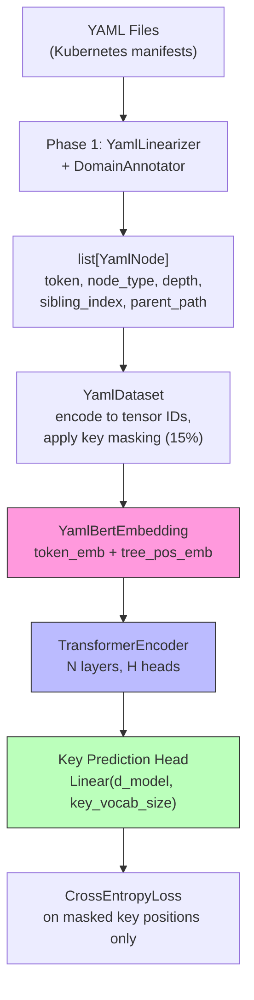
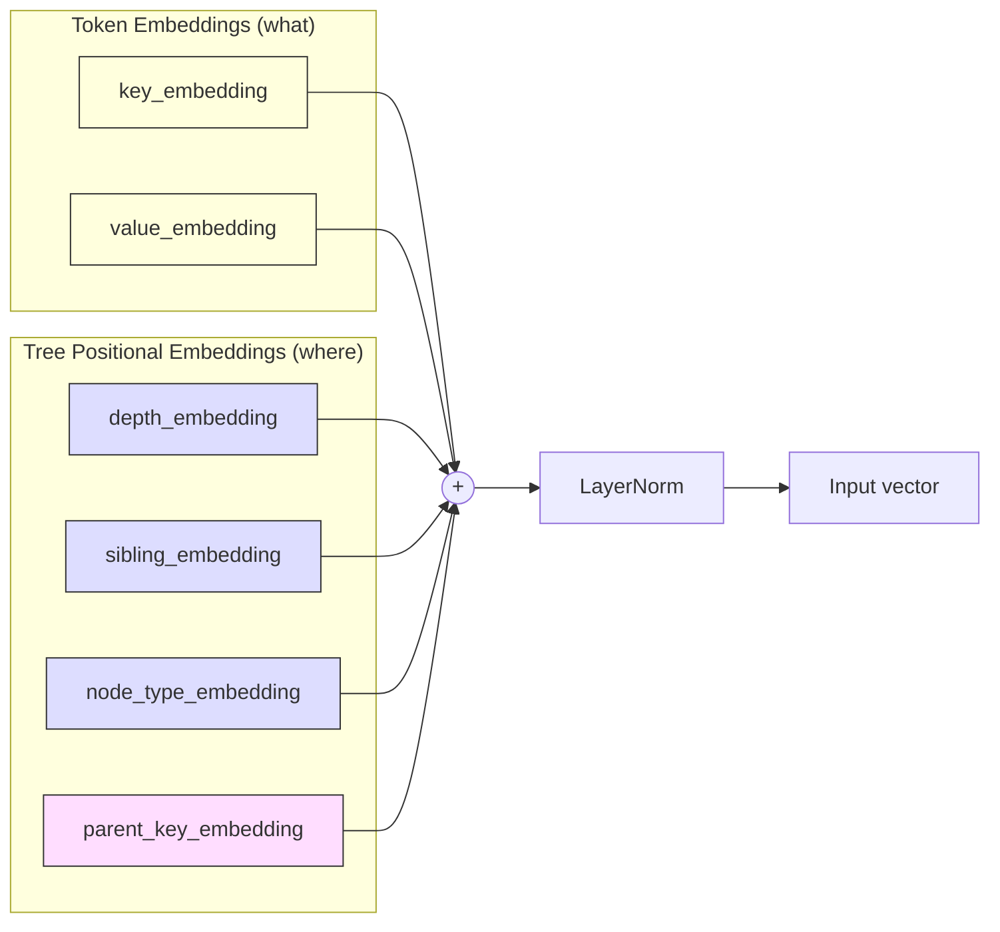
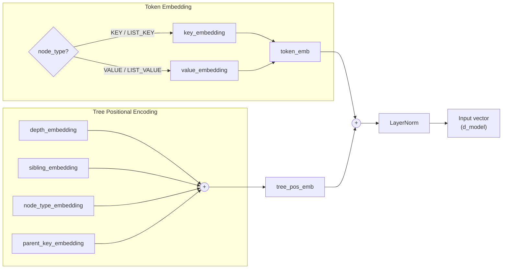
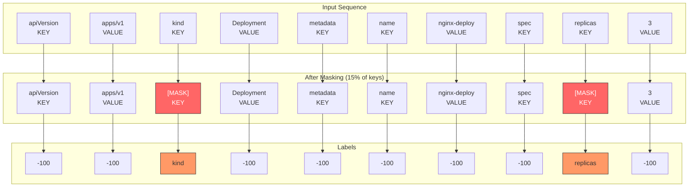
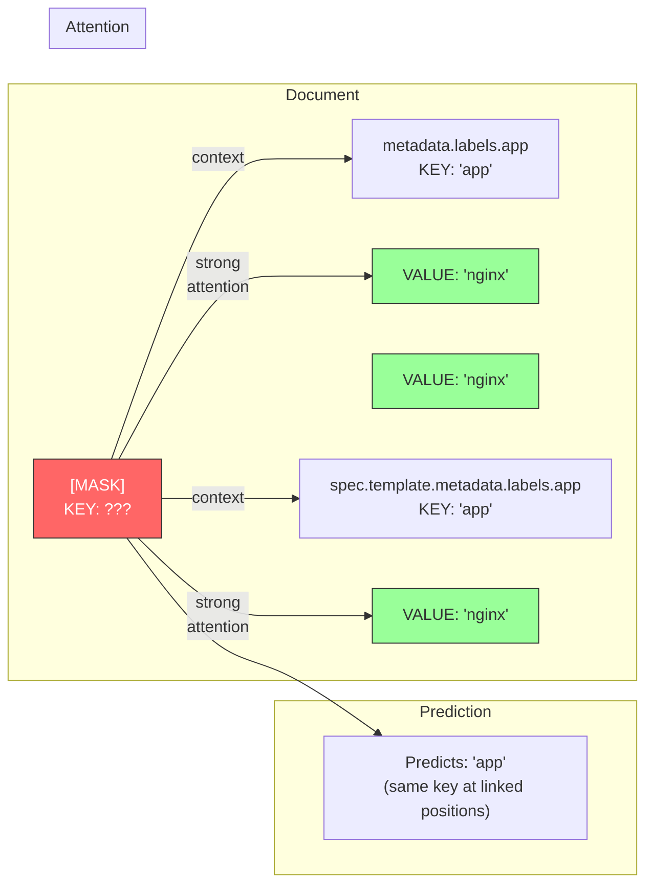

# YAML-BERT Phase 2: Tree Positional Encoding and Model

## Overview

Build the full YAML-BERT model: embedding layer with tree positional encoding, transformer encoder, masked key prediction head, and training loop. The embedding layer is the novel component — everything else is standard transformer machinery.

## Architecture



## Embedding Layer

The core novelty. Each node's input vector is the sum of a token embedding and a tree positional encoding:

```
input(node) = token_emb(token) + tree_pos(node)
```

### All Embedding Tables

Six separate learned embedding tables, all projecting to the same `d_model` space:



| Table | Size | Index | Role |
|-------|------|-------|------|
| `key_embedding` | key_vocab_size x d_model | key token ID | "I am this key" — e.g., `spec`, `replicas`, `name` |
| `value_embedding` | value_vocab_size x d_model | value token ID | "I am this value" — e.g., `nginx`, `Always`, `3` |
| `depth_embedding` | max_depth x d_model | depth integer (0, 1, 2, ...) | "I am at this depth" — depth 0 = top-level keys like `apiVersion`, `kind`; depth 1 = `name`, `replicas`; deeper = nested fields |
| `sibling_embedding` | max_sibling x d_model | sibling_index integer (0, 1, 2, ...) | "I am the Nth child" — in K8s, key ordering follows conventions: `apiVersion` is often sibling 0, `kind` sibling 1 under root |
| `node_type_embedding` | 4 x d_model | NodeType enum (0-3) | "I am KEY / VALUE / LIST_KEY / LIST_VALUE" — structural role of this node |
| `parent_key_embedding` | key_vocab_size x d_model | parent's key token ID (looked up by child) | "My parent is this key" — the child looks up its parent's key ID and gets a vector representing the parent-child relationship. This vector is distinct from what the parent gets from `key_embedding` for the same key: `parent_key_embedding["spec"]` ("spec is my parent") differs from `key_embedding["spec"]` ("I am spec") |

### Token Embedding

Two embedding tables use key vocabulary IDs (`key_embedding` and `parent_key_embedding` — same IDs, independently learned weights). One uses value vocabulary IDs. The remaining three use their own integer indices (depth, sibling, node type). All project to `d_model`:

```python
# Token role: "I am this key/value"
self.key_embedding: nn.Embedding      # key_vocab_size x d_model
self.value_embedding: nn.Embedding    # value_vocab_size x d_model

# Ancestry role: "my parent is this key"
self.parent_key_embedding: nn.Embedding  # key_vocab_size x d_model
```

Token embedding routing by node_type:
- KEY / LIST_KEY nodes → `key_embedding(token_id)`
- VALUE / LIST_VALUE nodes → `value_embedding(token_id)`

`parent_key_embedding` is used for all nodes regardless of type — every node has a parent key.

### Tree Positional Encoding



Four learned embedding components, summed:

```python
tree_pos = (depth_embedding(depth)
          + sibling_embedding(sibling_index)
          + node_type_embedding(node_type)
          + parent_key_embedding(parent_key_id))
```

| Component | Table size | What it captures |
|-----------|-----------|-----------------|
| `depth_embedding` | max_depth x d_model | Vertical position in tree |
| `sibling_embedding` | max_sibling x d_model | Horizontal position among siblings |
| `node_type_embedding` | 4 x d_model | KEY, VALUE, LIST_KEY, LIST_VALUE |
| `parent_key_embedding` | key_vocab_size x d_model | Immediate parent key |

**`parent_key_id`** is extracted from `parent_path`: the last non-numeric component. For a node with `parent_path="spec.template.spec.containers.0"`, the parent key is `"containers"`. See the [Phase 1 tokenizer design](2026-03-28-yaml-tokenizer-design.md) for how `parent_path` is constructed during linearization.

### Concrete Example: YAML Tree to Embeddings

Given this YAML fragment:

```yaml
spec:
  replicas: 3
status:
  replicas: 2
```

The tree and its positional encoding components:

```
                            (root)
                           /      \
                         /          \
        +--------------+              +--------------+
        | spec         |              | status       |
        | KEY, d=0     |              | KEY, d=0     |
        | sib=0        |              | sib=1        |
        | parent=root  |              | parent=root  |
        +--------------+              +--------------+
              |                             |
    +-------------------+         +-------------------+
    | replicas          |         | replicas          |
    | KEY, d=1          |         | KEY, d=1          |
    | sib=0             |         | sib=0             |
    | parent=spec  [!!] |         | parent=status [!!]|
    +-------------------+         +-------------------+
              |                             |
    +-------------------+         +-------------------+
    | 3                 |         | 2                 |
    | VALUE, d=1        |         | VALUE, d=1        |
    | sib=0             |         | sib=0             |
    | parent=replicas   |         | parent=replicas   |
    +-------------------+         +-------------------+
```

Both `replicas` nodes have **identical** token, depth, sibling_index, and node_type. The **parent_key_embedding** is what distinguishes them:

```
replicas under spec:   depth_emb(1) + sib_emb(0) + type_emb(KEY) + parent_emb("spec")   --> orange
replicas under status: depth_emb(1) + sib_emb(0) + type_emb(KEY) + parent_emb("status")  --> blue
```

### Why This Design

**Why parent key, not just depth + sibling?** Option A from the original plan (depth + sibling + node_type only) fails on a key success criterion:

```yaml
spec:
  replicas: 3      # depth=1, sibling=0, KEY
status:
  replicas: 3      # depth=1, sibling=0, KEY
```

Both `replicas` nodes get identical positional encodings under Option A. Adding parent_key distinguishes them: one has `parent_key="spec"`, the other `parent_key="status"`.

**Why learned embeddings, not sinusoidal?** Sinusoidal encoding provides built-in relative position via rotation matrices. With learned embeddings, relative depth relationships must be learned. But with only ~10 depth levels, this is easily learnable. The parent_key component is categorical and must be learned anyway.

**Why additive (sum), not concatenation?** Summing keeps the hidden dimension at `d_model`. Concatenation would require `d_model * 6` or smaller per-component dims. Additive encoding follows BERT convention and allows the attention mechanism to decompose components via learned Q/K projections.

### Combined Formula

```
input(node) = LayerNorm(token_emb(token) + depth_emb(depth) + sibling_emb(sibling)
            + type_emb(node_type) + parent_key_emb(parent_key))
```

LayerNorm after summing, following BERT convention.

## Model

```python
class YamlBertModel(nn.Module):
    def __init__(
        self,
        embedding: YamlBertEmbedding,
        d_model: int,
        num_layers: int,
        num_heads: int,
        key_vocab_size: int = ...,
    ) -> None:
        self.embedding: YamlBertEmbedding
        self.encoder: nn.TransformerEncoder  # num_layers, num_heads
        self.key_prediction_head: nn.Linear  # d_model -> key_vocab_size
```

- `d_ff = 4 * d_model` (standard BERT ratio)
- **One prediction head** — keys only. Values are never predicted.
- `padding_mask` for variable-length sequences in a batch.
- Forward pass returns `key_logits: torch.Tensor` of shape `(batch_size, seq_len, key_vocab_size)`.

### Why One Prediction Head, Not Two

Values are never masked or predicted. They serve as **context** for the attention mechanism. The model learns structural patterns by predicting keys; values provide the signal for cross-reference learning.

With diverse training data (~9000 manifests from 3 clusters), the model cannot memorize that `containers.0.name` is `"nginx"` — the value is different every time. The only stable pattern is structural: "a `name` key always appears under container list items." That is what the model learns.

Cross-references (e.g., label values matching selector values) are learned because the attention mechanism can see the unmasked values at linked positions. When predicting a masked key at `spec.selector.matchLabels`, the model attends to `metadata.labels` and sees matching value tokens — learning that these positions are linked.

## Dataset and Masking

### Masking Strategy



Values (apps/v1, Deployment, nginx-deploy, 3) are **never masked** — they serve as context. Only keys are masked. Loss is computed only at positions with labels other than -100.

- **Only KEY and LIST_KEY nodes are candidates for masking.** VALUE and LIST_VALUE nodes are never masked.
- **15% of eligible key nodes** are selected for masking per document.
- Of the selected 15%:
  - **80%**: replace token_id with `[MASK]` id
  - **10%**: replace with a random key from key_vocab
  - **10%**: keep unchanged
- `labels` tensor: original key token id at masked positions, `-100` (PyTorch ignore index) elsewhere.

### Dataset Interface

```python
class YamlDataset(Dataset):
    def __init__(
        self,
        yaml_dir: str,
        vocab: Vocabulary,
        linearizer: YamlLinearizer,
        annotator: DomainAnnotator,
        mask_prob: float = 0.15,
        max_seq_len: int = 512,
    ) -> None: ...

    def __getitem__(self, idx: int) -> dict[str, torch.Tensor]:
        # Returns:
        # {
        #     "token_ids":       tensor,  # keys may be masked, values never
        #     "node_types":      tensor,
        #     "depths":          tensor,
        #     "sibling_indices": tensor,
        #     "parent_key_ids":  tensor,
        #     "labels":          tensor,  # original key ids at masked positions, -100 elsewhere
        # }
```

### Sequence Length

Kubernetes manifests vary in size. A typical Deployment linearizes to ~30-80 nodes. Large manifests (StatefulSets with multiple containers) can reach ~200 nodes. `max_seq_len=512` provides headroom.

Documents shorter than `max_seq_len` are padded with `[PAD]`. Documents longer are truncated (rare with K8s manifests).

### Collate Function

Batches require padding to the longest sequence in the batch. A custom `collate_fn`:
- Pads all tensors to max length in batch
- Creates `padding_mask` tensor (True where padded)
- Returns batched dict of tensors

## Training

```python
class YamlBertTrainer:
    def __init__(
        self,
        model: YamlBertModel,
        dataset: YamlDataset,
        lr: float = 1e-4,
        batch_size: int = 16,
        num_epochs: int = 50,
    ) -> None: ...
```

### Loss

```python
loss = CrossEntropyLoss(ignore_index=-100)(key_logits, labels)
```

Computed over all positions, but `-100` labels at non-masked positions are ignored. Only masked key positions contribute to the loss.

### Optimizer

AdamW with `lr=1e-4`, `weight_decay=0.01`. Standard for small BERT-like models.

### Logging

Print loss per epoch. Track training loss over time to verify convergence.

### Checkpointing

Save model state dict every 10 epochs and at the end of training.

## Hyperparameters Summary

| Parameter | Value | Rationale |
|-----------|-------|-----------|
| d_model | 256 | Sufficient capacity for ~9000+ manifests |
| num_layers | 6 | Deep enough for cross-field pattern learning |
| num_heads | 8 | 32 dims per head, good granularity for structural attention |
| d_ff | 4 x d_model | Feed-forward intermediate dimension (BERT convention) |
| max_depth | 16 | Covers deepest K8s YAML nesting |
| max_sibling | 32 | Covers widest sibling counts |
| mask_prob | 0.15 | Standard BERT masking rate |
| lr | 1e-4 | Standard for transformer pre-training |
| batch_size | 32 | Reasonable for ~9000 document corpus |
| num_epochs | 30 | Larger corpus, fewer epochs needed |
| max_seq_len | 512 | Headroom for large manifests |

## How Cross-References Are Learned

The model learns cross-references through attention, without special tokens or architecture changes:



The masked key at `spec.selector.matchLabels` attends to unmasked values at `metadata.labels` and `spec.template.metadata.labels`. These positions share the value `"nginx"` — the model learns that this structural pattern (same value at these tree positions) is consistent across thousands of documents, with different actual values each time. The relationship is learned, not the value.

## Success Criteria

1. **Training converges** — loss decreases over epochs, doesn't diverge.
2. **Key prediction accuracy** — model predicts masked keys with reasonable accuracy (>50% on common keys like `name`, `spec`, `metadata`).
3. **Tree position differentiation** — the embedding for `spec` at depth 0 (Deployment spec) is measurably different from `spec` at depth 2 (Pod spec). Measure with cosine similarity.
4. **Parent-aware differentiation** — `replicas` under `spec` has a different embedding from `replicas` under `status`. The parent_key component should drive this.
5. **Attention patterns** — at least one attention head shows cross-reference patterns (attending from label selectors to labels).

## Project Structure

```
yaml_bert/
├── types.py            # YamlNode, NodeType (existing)
├── linearizer.py       # YamlLinearizer (existing)
├── vocab.py            # Vocabulary, VocabBuilder (existing)
├── annotator.py        # DomainAnnotator (existing)
├── embedding.py        # YamlBertEmbedding (new)
├── model.py            # YamlBertModel (new)
├── dataset.py          # YamlDataset (new)
└── trainer.py          # YamlBertTrainer (new)
tests/
├── test_embedding.py   # (new)
├── test_model.py       # (new)
├── test_dataset.py     # (new)
└── test_trainer.py     # (new)
```

## Dependencies

Phase 1 dependencies plus:
- PyTorch >= 2.0

## What This Does NOT Cover

- Tree bias in attention mechanism (future enhancement — modify attention scores with tree distance between node pairs)
- Sub-tokenization of compound values
- Value prediction / value masking
- Downstream tasks (anomaly detection, missing field prediction)
- Scaling to full BERT-base size

## References

- BERT: "Pre-training of Deep Bidirectional Transformers" (Devlin et al., 2019)
- Tree-Transformer: "Tree Transformer: Integrating Tree Structures into Self-Attention" (Wang et al., 2019)
- ALiBi: "Train Short, Test Long" (Press et al., 2022) — for relative position bias in attention
- docs/tree-positional-encoding-explained.md — mathematical foundations of tree positional encoding
